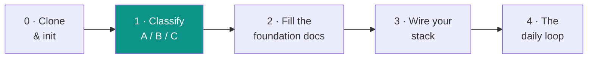
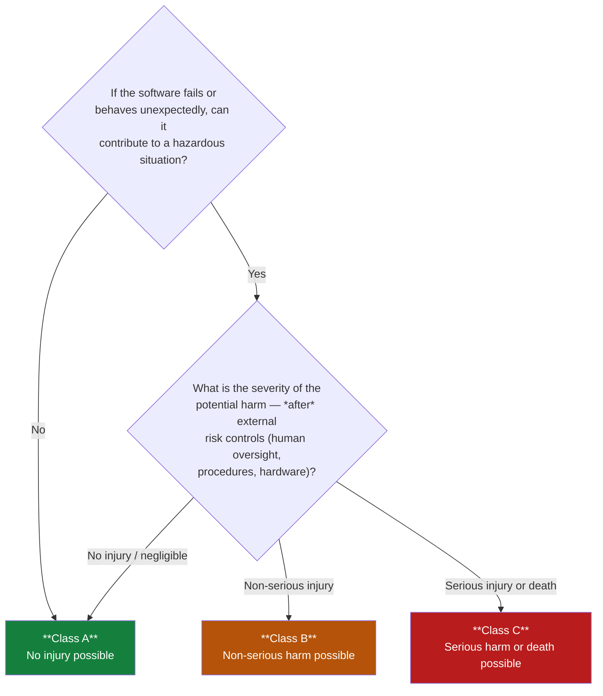
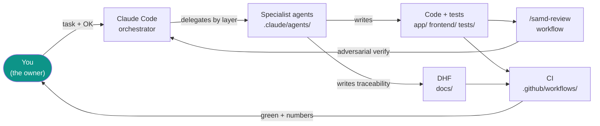

# Getting Started

> Your first hour with the SaMD Starter Kit. This page is the **guided path**: what to do, in what order, and which of the 40+ documents actually apply to *your* device. Read it top to bottom once — then come back to it as a map.

**English · this is the onboarding front-door. The Design History File under [`docs/`](docs/) is written in Spanish (it's the regulatory record); this guide bridges into it.**

---

## What you're holding

This kit is **scaffolding + methodology**, not an application. It gives you:

- A **team of AI agents** (in `.claude/agents/`) pre-loaded with the compliance rules of each layer.
- A complete **Design History File (DHF)** — 40+ regulatory & process templates with `{{placeholders}}` ready to fill.
- The **rules** (`CLAUDE.md`), a **multi-agent review workflow**, and **working CI**.
- A **worked example** ([`examples/auralog/`](examples/auralog/)) showing the templates filled in.

You bring your application code into `app/` (backend), `frontend/` (client) and `tests/`. The kit handles the *process* around it that **IEC 62304 + ISO 14971** demand.

---

## The path: 5 steps



### Step 0 — Clone & make it yours

```bash
git clone <this-repo> my-medical-device
cd my-medical-device
rm -rf .git && git init        # start your own history
bash scripts/init_kit.sh       # fill the {{...}} placeholders interactively
```

`init_kit.sh` asks for your project name, owner, safety class, stack and chat language, then replaces every `{{...}}` placeholder across the repo. When it finishes it prints your next steps. You can re-run it any time.

> Don't have all the answers yet? Press Enter to skip a field — it stays as a placeholder you can fill later.

### Step 1 — Classify your software (A / B / C)

**This is the single most important decision.** The class drives how much rigor everything else demands. Use the tree below, then record the result in
[`docs/07_regulatory_and_compliance/SOFTWARE_SAFETY_CLASSIFICATION.md`](docs/07_regulatory_and_compliance/SOFTWARE_SAFETY_CLASSIFICATION.md).



The class is assigned **after** considering external risk controls (IEC 62304 §4.3). A clinician reviewing every output, or a hardware interlock, can lower the residual class. Be honest: an external auditor will challenge an optimistic classification first.

> Not sure? Default **up**, not down. Starting at B and relaxing to A later is cheap; discovering mid-certification that you're really a C is not.

### Step 2 — Fill the foundation documents (in order)

Don't open all 40 documents. Fill these **four**, in this order — each one feeds the next:

| # | Document | Why it's first |
|---|---|---|
| 1 | [`SOFTWARE_SAFETY_CLASSIFICATION`](docs/07_regulatory_and_compliance/SOFTWARE_SAFETY_CLASSIFICATION.md) | The class drives everything else. |
| 2 | [`MASTER_MAP`](docs/00_master/MASTER_MAP.md) | The living map of your device — identity, architecture, critical modules. |
| 3 | [`ISO_14971_RISK_MATRIX`](docs/07_regulatory_and_compliance/ISO_14971_RISK_MATRIX.md) | Your hazards and the controls for each. |
| 4 | [`TRACEABILITY_MATRIX_SAMD`](docs/07_regulatory_and_compliance/TRACEABILITY_MATRIX_SAMD.md) | The chain: need → REQ → design → test → risk. |

See [`examples/auralog/`](examples/auralog/) for these exact four, filled in for a fictional Class B device — the fastest way to understand what "good" looks like.

**Then read by class** — only what applies to you:

| Read this if you are… | Documents |
|---|---|
| **Class A, B or C** (everyone) | Safety classification · Master Map · Risk matrix · Traceability · [Development guide](docs/03_software_development_plan/DEVELOPMENT_GUIDE_COMPLETE.md) · [Testing strategy](docs/03_software_development_plan/COMPLETE_TESTING_STRATEGY.md) · SOUP inventory · Privacy & security |
| **Class B or C** (add) | [Architecture & item segregation](docs/02_architecture_and_design/ARCHITECTURE_OVERVIEW.md) · [Software development plan](docs/03_software_development_plan/SOFTWARE_DEVELOPMENT_PLAN.md) · [Risk-control traceability](docs/07_regulatory_and_compliance/RISK_CONTROL_TRACEABILITY.md) · [Clinical evaluation](docs/07_regulatory_and_compliance/CLINICAL_EVALUATION_PLAN.md) · [Post-market surveillance](docs/07_regulatory_and_compliance/POST_MARKET_SURVEILLANCE_PLAN.md) · [User documentation](docs/04_user_documentation/) |
| **Class C** (add the full rigor) | Detailed design records · Independent verification of each risk control · Usability summative testing (IEC 62366) · Strongest clinical evidence · [ISO 13485 QMS readiness](docs/07_regulatory_and_compliance/ISO_13485_READINESS_PLAN.md) |

> Class A still needs the basics — a "no harm possible" claim must itself be *documented and defensible*. There is no zero-paperwork class for a medical device.

The full route to certification lives in [`CERTIFICATION_HOWTO`](docs/07_regulatory_and_compliance/CERTIFICATION_HOWTO.md).

### Step 3 — Wire your stack

The `app/`, `frontend/` and `tests/` folders ship as READMEs describing the expected structure and the hard rules. Bring your code in:

- **`app/`** — your backend. Hard rules: identity from the token only, fully async, strict typing, no tracebacks to the user, fail-safe with `503 + Retry-After`. See [`.claude/agents/backend.md`](.claude/agents/backend.md).
- **`frontend/`** — your client. Hard rules: offline-first, flat design (no glassmorphism), `prefers-reduced-motion` honored, accessible labels. See [`.claude/agents/frontend.md`](.claude/agents/frontend.md).
- **`tests/`** — rigorous assertions, not smoke tests. See [`COMPLETE_TESTING_STRATEGY`](docs/03_software_development_plan/COMPLETE_TESTING_STRATEGY.md).

The reference stack is React+TS / Python+FastAPI, but the rules are stack-agnostic — adapt the commands in `CLAUDE.md` to yours.

### Step 4 — The daily loop

This is how you actually work day to day with the agent team:



1. You give a task and an explicit OK.
2. The orchestrator delegates to the layer specialist (`backend`, `frontend`, `db-architect`, …).
3. The agent writes code **and** its traceability in the DHF, in the same change.
4. The [`samd-review` workflow](.claude/workflows/) reviews the diff across risk dimensions with adversarial verification.
5. CI checks lint, types, tests, contract drift and traceability.
6. Nothing is "done" until tests are green **with numbers reported** — and **nobody commits without your OK**.

The full rulebook is [`CLAUDE.md`](CLAUDE.md); the agent-agnostic process mirror is [`.agents/workflows/protocolo_desarrollo.md`](.agents/workflows/protocolo_desarrollo.md).

---

## First-hour checklist

- [ ] Cloned, re-init'd git, ran `scripts/init_kit.sh`
- [ ] No stray `{{...}}` placeholders left (`grep -rn "{{[A-Z_]*}}" . --exclude-dir=.git`)
- [ ] Safety class decided and recorded
- [ ] Read the four foundation docs in the AuraLog example
- [ ] Skimmed `CLAUDE.md` (Rule 0) and `CONTRIBUTING.md`
- [ ] Brought a first slice of your app into `app/` / `frontend/` with a real test
- [ ] Ran `bash scripts/run_local_ci.sh` once to see the gates

---

## Where to go next

| You want to… | Go to |
|---|---|
| Understand the rules the agents enforce | [`CLAUDE.md`](CLAUDE.md) |
| Navigate the whole DHF | [`docs/README.md`](docs/README.md) |
| See the templates filled in | [`examples/auralog/`](examples/auralog/) |
| Plan the road to certification | [`CERTIFICATION_HOWTO`](docs/07_regulatory_and_compliance/CERTIFICATION_HOWTO.md) |
| Learn the multi-agent method | [`MULTI_AGENT_ENGINEERING_METHOD`](docs/09_engineering_experience/MULTI_AGENT_ENGINEERING_METHOD.md) |
| Avoid known production traps | [`PRODUCTION_LESSONS`](docs/09_engineering_experience/PRODUCTION_LESSONS.md) |

---

> **This kit is a process scaffold, not regulatory advice and not a guarantee of certification.** Safety classification, clinical evidence and device approval require the judgment of regulatory professionals and, depending on your market, a Notified Body or the relevant health authority.
