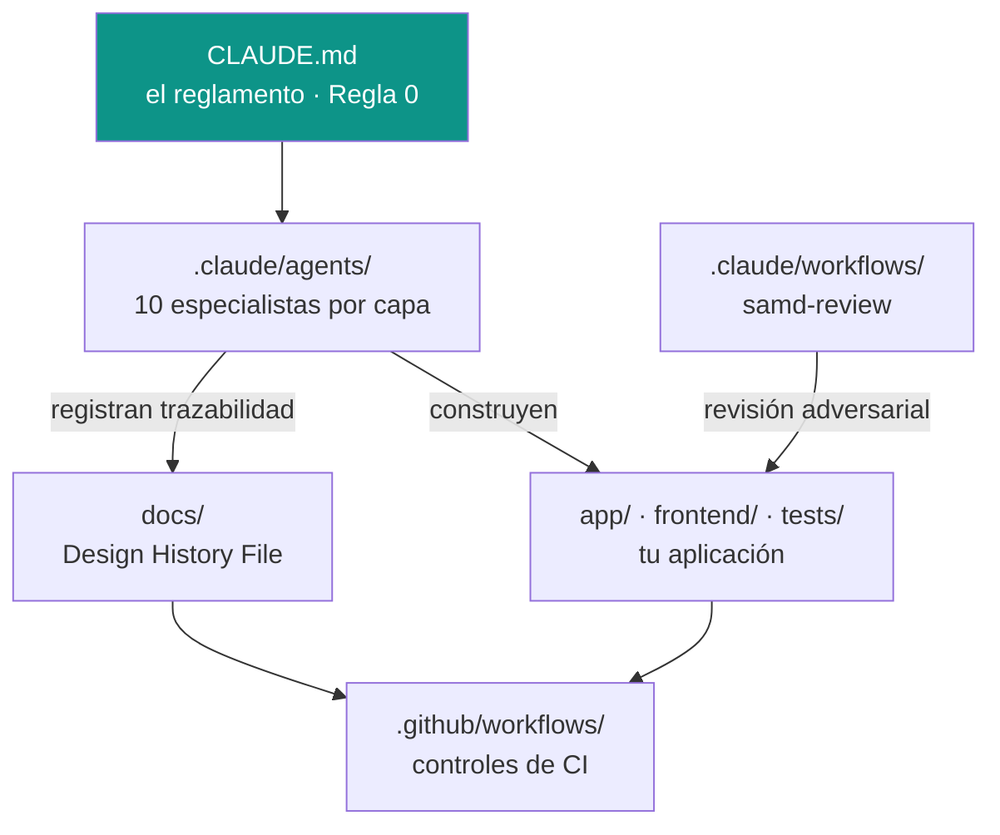

<div align="center">


### Kit de arranque para construir un dispositivo software médico (SaMD) con un equipo de agentes de IA.

[](CHANGELOG.md)
[](LICENSE)
[](docs/07_regulatory_and_compliance/SOFTWARE_SAFETY_CLASSIFICATION.md)
[](docs/07_regulatory_and_compliance/ISO_14971_RISK_MATRIX.md)
[](CLAUDE.md)
[](https://claude.com/claude-code)
[](CHANGELOG.md)
[](CONTRIBUTING.md)

**[English](README.md) · Español**

[Arranque](#arranque-en-60-segundos) · [Guía de arranque](GETTING_STARTED.md) · [Qué hay adentro](#qué-hay-adentro) · [Design History File](docs/) · [Ejemplo trabajado](examples/auralog/) · [Contribuir](CONTRIBUTING.md)

</div>

---

Destila la experiencia de un proyecto SaMD Clase B real: un equipo de agentes especializados, el reglamento de cumplimiento, los workflows multi-agente, la estructura de memoria y el Design History File (DHF) regulatorio completo — todo generalizado en plantillas listas para adaptar.

Este repositorio NO es una aplicación. Es el **andamiaje y la metodología** para que vos (y tu agente de IA, como Claude Code) arranquen un SaMD de cero sin reinventar el proceso de cumplimiento, testing y trazabilidad que IEC 62304 + ISO 14971 exigen.

## Arranque en 60 segundos

```bash
git clone https://github.com/bryan-basg/samd-starter-kit mi-dispositivo-medico
cd mi-dispositivo-medico
rm -rf .git && git init        # arrancá tu propia historia
bash scripts/init_kit.sh       # rellena los marcadores {{...}} con tu proyecto
```

**Después abrí [`GETTING_STARTED.md`](GETTING_STARTED.md)** — el camino guiado: clasificá tu software (A/B/C), completá los cuatro documentos base en orden, conectá tu stack y aprendé el ciclo diario con el equipo de agentes. Te dice cuáles de los 40+ documentos aplican a *tu* clase, para que no te ahogues en plantillas.

## ¿Para quién es?

- **Una persona o startup** que arranca un software de salud y no quiere descubrir el cumplimiento regulatorio a los golpes.
- **Una medtech / empresa de dispositivos médicos** que quiere un andamiaje de proceso (IEC 62304 + ISO 14971) listo, con trazabilidad por diseño.
- **Equipos que trabajan con agentes de IA** (Claude Code) y quieren un equipo de especialistas con las reglas SaMD precargadas.

## ¿Qué hay adentro?

| Pieza | Path | Qué es |
|---|---|---|
| **Reglamento del agente** | `CLAUDE.md` | La "Regla 0" (SaMD es prioridad absoluta) + cómo trabaja el agente, testing, orquestación multi-agente. |
| **Equipo de 10 agentes** | `.claude/agents/` | Especialistas por capa: `backend`, `frontend`, `db-architect`, `cloud-ops`, `qa-mutation`, `security-samd`, `samd-audit-trace`, `docs-dhf`, `i18n-translations`, `mobile-native`. |
| **Comando + skill** | `.claude/commands/`, `.claude/skills/` | `samd-trace`: análisis de impacto (§5.6) antes de declarar algo "arreglado". |
| **Workflow multi-agente** | `.claude/workflows/` | `samd-review`: revisión del diff por dimensiones de riesgo con verificación adversarial. |
| **Protocolo de desarrollo** | `.agents/workflows/` | Espejo agnóstico al agente del proceso estable. |
| **Memoria** | `memory/MEMORY.md` | Estructura de memoria persistente del agente. |
| **RFCs de ejemplo** | `docs/05_design_decisions/RFC-001..003` | Tres decisiones SaMD reales ya escritas (cifrado en reposo, identidad JWT-only, scheduler externo). |
| **Design History File** | `docs/` | 40+ plantillas regulatorias y de proceso: ISO 14971, trazabilidad SaMD, plan IEC 62304, clasificación, SOUP, evaluación/validación clínica, post-market, IFU, docs de usuario, privacidad, runbooks. |
| **CI/CD funcional** | `.github/workflows/` | 11 workflows: gates de CI, seguridad (Trivy+Semgrep), mutación (Stryker), fuzz de API (schemathesis), DAST (OWASP ZAP), SBOM, tier Postgres, drift del contrato OpenAPI, auditoría del estado, stale PRs, y una plantilla de deploy. Stack de referencia React+TS / Python+FastAPI. |
| **Esqueleto ejecutable** | `app/` · `frontend/` · `tests/` | Un ejemplo mínimo FastAPI + React/TS que cablea las reglas duras (identidad solo del token, AES-256-GCM en reposo, fail-safe, UI plana y accesible). Corre sin infra: `pytest` 8/8, `vitest` 5/5. Borralo cuando traigas tu app. |
| **Ejemplo trabajado** | `examples/auralog/` | Un dispositivo Clase B ficticio (AuraLog) con su DHF rellenado — el kit en acción. |

## Cómo encajan las piezas



El reglamento configura a los agentes; los agentes construyen tu código **y** mantienen el DHF sincronizado; el workflow de revisión y el CI son los controles. ¿Recién llegás? Empezá por **[`GETTING_STARTED.md`](GETTING_STARTED.md)**.

## La idea: cumplimiento por diseño, no como sprint aparte

La regla central es la **Regla 0**: *toda decisión técnica se subordina al cumplimiento SaMD*. En la práctica, cuatro hábitos que el equipo de agentes hace cumplir solo:

1. **Trazabilidad obligatoria** (§5.1/§5.7): cada cambio clínico/schema/seguridad deja rastro en el DHF en el mismo PR.
2. **Verificación demostrable** (§5.7): nada se declara "verde" sin correr los tests vinculados y reportar números.
3. **Fail-safe explícito** (ISO 14971): cuando algo falla, degrada de forma segura y predecible — nunca en silencio.
4. **Análisis de impacto antes de fixear** (§5.6): un bug se arregla tras revisar TODOS los consumidores del símbolo.

## Reglas duras que el kit hace cumplir

- Nadie commitea ni pushea sin OK explícito del dueño.
- El motor de mutation nunca corre en paralelo con agentes que escriben tests.
- Verificación adversarial obligatoria sobre hallazgos clínicos/seguridad antes de actuar.
- Identidad solo del token (JWT-only) — nunca `user_id` desde el cliente.
- Errores sin tracebacks al usuario — mensajes empáticos + código HTTP correcto.

## Field notes y metodología

El kit no son solo plantillas — trae la **experiencia ganada en la trinchera** que hay detrás. Basadas en incidentes reales de producción, generalizadas (sin datos del producto):

- **[Lecciones de producción](docs/09_engineering_experience/PRODUCTION_LESSONS.md)** — qué rompió en producción y qué se aprendió: pool agotado disfrazado de error de auth, el "verde" de migración que miente, footguns de env vars, disciplina offline-first, tests de mutation como contratos.
- **[Arquitectura de referencia](docs/09_engineering_experience/REFERENCE_ARCHITECTURE.md)** — el patrón híbrido offline-first (cliente + API + BD transaccional + nube) con el *porqué* de cada decisión y cuándo **no** usarlo.
- **[Método "Mesa de Ingenieros"](docs/09_engineering_experience/MULTI_AGENT_ENGINEERING_METHOD.md)** — orquestar un equipo de agentes de IA sobre un código regulado sin perder cohesión: el protocolo anti-drift, la verificación adversarial y las reglas duras que un modelo mejor no anula.

## Estándares cubiertos

IEC 62304 · ISO 14971 · ISO 13485 · IEC 62366 · WCAG 2.1 AA · GDPR + HIPAA.

## Qué NO es

Este kit es un **andamiaje de proceso**, no asesoría regulatoria ni garantía de certificación. La clasificación, la evidencia clínica y la aprobación de un dispositivo médico requieren el juicio de profesionales regulatorios y, según el mercado, un Organismo Notificado o la autoridad sanitaria correspondiente.

## Origen

Este kit no nació como una plantilla. Se **extrajo de una plataforma SaMD Clase B real, en producción** — una aplicación de salud offline-first construida y operada de punta a punta: backend, capa de datos, nube, CI/CD, el DHF regulatorio y un equipo de agentes de IA llevando el trabajo. Los agentes, reglas, workflows y lecciones que ves acá son lo que de verdad sobrevivió al contacto con la producción y la regulación.

Mantenido por [@bryan-basg](https://github.com/bryan-basg). Si te ahorra aprender estas lecciones a las malas, cumplió su trabajo.

## Contribuir

Ver [CONTRIBUTING.md](CONTRIBUTING.md). Reportes de seguridad: en privado, ver [SECURITY.md](.github/SECURITY.md).

## Licencia

[MIT](LICENSE).
