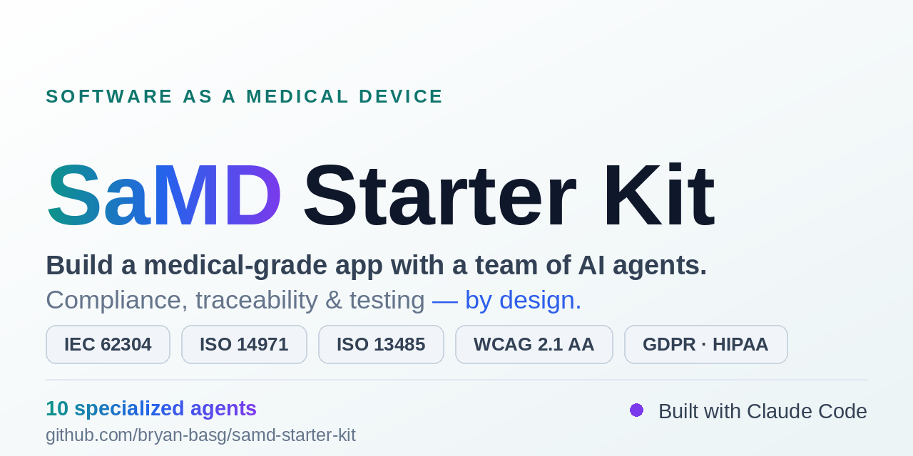
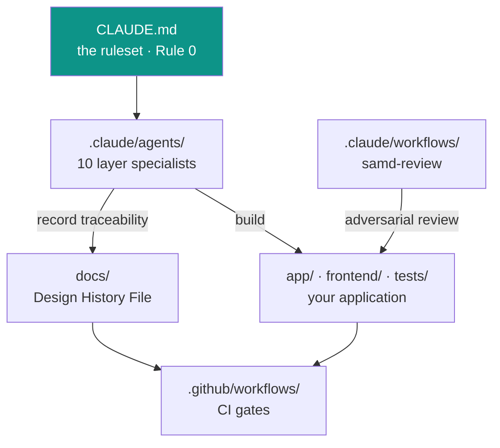

<div align="center">



### A starter kit to build Software as a Medical Device (SaMD) with a team of AI agents.

[](CHANGELOG.md)
[](LICENSE)
[](docs/07_regulatory_and_compliance/SOFTWARE_SAFETY_CLASSIFICATION.md)
[](docs/07_regulatory_and_compliance/ISO_14971_RISK_MATRIX.md)
[](CLAUDE.md)
[](https://claude.com/claude-code)
[](CHANGELOG.md)
[](CONTRIBUTING.md)

[](https://github.com/bryan-basg/samd-starter-kit/actions/workflows/ci.yml)
[](https://github.com/bryan-basg/samd-starter-kit/actions/workflows/kit-quality.yml)
[](https://github.com/bryan-basg/samd-starter-kit/actions/workflows/placeholder-guard.yml)

**English · [Español](README.es.md)**

[Quickstart](#60-second-quickstart) · [Getting started](GETTING_STARTED.md) · [The 10 agents](#the-10-agent-team) · [Design History File](docs/) · [Worked example](examples/auralog/) · [Contributing](CONTRIBUTING.md)

</div>

---

This kit distills the experience of a real SaMD Class B project: a team of specialized AI agents, the compliance ruleset, multi-agent workflows, the persistent memory structure, and a complete regulatory Design History File (DHF) — all generalized into ready-to-adapt templates.

This repository is **not an application**. It is the **scaffolding and methodology** so that you (and your AI coding agent, such as Claude Code) can start a SaMD from scratch without reinventing the compliance, testing, and traceability process that **IEC 62304 + ISO 14971** demand.

## 60-second quickstart

```bash
git clone https://github.com/bryan-basg/samd-starter-kit my-medical-device
cd my-medical-device
rm -rf .git && git init -b main   # start your own history
bash scripts/init_kit.sh       # interactive & re-runnable: fills the {{...}} placeholders
```

**Then open [`GETTING_STARTED.md`](GETTING_STARTED.md)** — the guided path: classify your software (A/B/C), fill the four foundation documents in order, wire your stack, and learn the daily loop with the agent team. It tells you which of the 40+ documents actually apply to *your* class, so you don't drown in templates.

## Who is this for?

- **A solo founder or startup** building health software who doesn't want to discover regulatory compliance the hard way.
- **A medtech / medical-device company** that wants a ready process scaffold (IEC 62304 + ISO 14971) with traceability by design.
- **Teams working with AI agents** (Claude Code) who want a crew of specialists with the SaMD rules pre-loaded.

## What's inside

| Piece | Path | What it is |
|---|---|---|
| **Agent ruleset** | `CLAUDE.md` | "Rule 0" (SaMD is the absolute priority) + how the agent works, testing, multi-agent orchestration. |
| **Team of 10 agents** | `.claude/agents/` | Per-layer specialists: `backend`, `frontend`, `db-architect`, `cloud-ops`, `qa-mutation`, `security-samd`, `samd-audit-trace`, `docs-dhf`, `i18n-translations`, `mobile-native`. |
| **Command + skill** | `.claude/commands/`, `.claude/skills/` | `samd-trace`: impact analysis (§5.6) before declaring anything "fixed". |
| **Multi-agent workflow** | `.claude/workflows/` | `samd-review`: diff review across risk dimensions with adversarial verification. |
| **Development protocol** | `.agents/workflows/` | Agent-agnostic mirror of the stable process. |
| **Memory** | `memory/MEMORY.md` | The agent's persistent memory structure. |
| **Example RFCs** | `docs/05_design_decisions/RFC-001..003` | Three real SaMD decisions already written (encryption at rest, JWT-only identity, external scheduler). |
| **Design History File** | `docs/` | 40+ regulatory & process templates: ISO 14971, SaMD traceability, IEC 62304 plan, safety classification, SOUP, clinical evaluation/validation, post-market, IFU, user docs, privacy, runbooks. |
| **Working CI/CD** | `.github/workflows/` | 15 workflows — 11 inheritable gates (CI, security via Trivy+Semgrep, mutation via Stryker, API fuzz via schemathesis, DAST via OWASP ZAP, SBOM, Postgres tier, OpenAPI contract-drift, project-state audit, stale PRs, deploy template) + 4 kit-maintenance (docs, quality gates, placeholder guard, release). Reference stack: React+TS / Python+FastAPI. |
| **Runnable skeleton** | `app/` · `frontend/` · `tests/` | A minimal FastAPI + React/TS example wiring the hard rules (token-only identity, AES-256-GCM at rest, fail-safe, flat accessible UI). Runs with zero infra: `pytest` 16/16, `vitest` 5/5. Delete it when you bring your own app. |
| **Worked example** | `examples/auralog/` | A fictional Class B device (AuraLog) with its DHF filled in — see the kit in action. |

## How the pieces fit together



The ruleset configures the agents; the agents build your code **and** keep the DHF in sync; the review workflow and CI are the gates. New here? Start with **[`GETTING_STARTED.md`](GETTING_STARTED.md)**.

## The idea: compliance by design, not as a separate sprint

The core rule is **Rule 0**: *every technical decision is subordinate to SaMD compliance*. In practice, four habits the agent team enforces on its own:

1. **Mandatory traceability** (§5.1/§5.7): every clinical/schema/security change is recorded in the DHF in the same PR.
2. **Demonstrable verification** (§5.7): nothing is declared "green" without running the linked tests and reporting numbers.
3. **Explicit fail-safe** (ISO 14971): when something fails, it degrades safely and predictably — never silently.
4. **Impact analysis before fixing** (§5.6): a bug is fixed after reviewing ALL consumers of the symbol, not just the file where it was reported.

## The 10-agent team

| Agent | Layer | Use it for |
|---|---|---|
| `backend` | API + logic | Routers, services, schemas, auth, audit, resilience fuses, tests. |
| `frontend` | UI + client | Components, hooks, DAOs, offline-first sync, UI tests, mutation, neuro-UX. |
| `db-architect` | Data | Schemas, migrations, connection pool, at-rest encryption, access rules. |
| `cloud-ops` | Platform | Compute, managed DB, scheduler, secret manager, hosting, CI/CD, deploys. |
| `qa-mutation` | Testing | Mutation testing waves, mutant killers, scoped configs, score ratchet. |
| `security-samd` | Security | SAST (Trivy+Semgrep+fuzz), encryption, key management, JWT-only, audit. |
| `samd-audit-trace` | Regulatory (audits) | Audits a changeset against IEC 62304 §5.1/§5.7 + ISO 14971. Reports gaps. |
| `docs-dhf` | Regulatory (writes) | Materializes DHF updates: Master Map, risk matrix, traceability, RFCs. |
| `i18n-translations` | i18n | Locales across all languages, key parity, anti "copied-untranslated" auditing, pre-certification clinical glossary. |
| `mobile-native` | Mobile | Packaging the web client as a native app (Capacitor/RN/equiv.), native plugins/auth/storage, push, build/sign/distribution. |

## Hard rules the kit enforces

- No one commits or pushes without the owner's explicit OK.
- The mutation engine never runs in parallel with agents writing tests.
- Adversarial verification is mandatory on clinical/security findings before acting.
- Identity comes only from the token (JWT-only) — never `user_id` from the client.
- Errors never expose tracebacks to the user — empathetic messages + correct HTTP code.

## Field notes & methodology

The kit isn't only templates — it carries the **hard-won experience** behind them. These are based on real production incidents, generalized (no product specifics):

- **[Startup discipline](docs/09_engineering_experience/STARTUP_DISCIPLINE.md)** — what to prioritize in the first days: compliance before code, memory and shipping discipline, avoiding over-building before validation, empathetic UX as a clinical decision.
- **[Production lessons](docs/09_engineering_experience/PRODUCTION_LESSONS.md)** — what broke in production and what we learned: pool exhaustion masquerading as auth failures, the migration "green" that lies, env-var footguns, offline-first discipline, mutation tests as contracts.
- **[Reference architecture](docs/09_engineering_experience/REFERENCE_ARCHITECTURE.md)** — the hybrid offline-first pattern (client + API + transactional DB + cloud) with the *why* behind each decision and when **not** to use it.
- **[The "Engineers' Table" method](docs/09_engineering_experience/MULTI_AGENT_ENGINEERING_METHOD.md)** — orchestrating a team of AI agents on a regulated codebase without losing coherence: the anti-drift protocol, adversarial verification, and the hard rules a better model doesn't override.

## Standards covered

IEC 62304 (medical software lifecycle) · ISO 14971 (risk management) · ISO 13485 (QMS) · IEC 62366 (usability) · WCAG 2.1 AA (accessibility) · GDPR + HIPAA (health data privacy/security).

## What this is NOT

This kit is a **process scaffold**, not regulatory advice and not a guarantee of certification. Safety classification, clinical evidence, and approval of a medical device require the judgment of regulatory professionals and, depending on the market, a Notified Body or the relevant health authority.

## Origin

This kit didn't start as a template. It was **extracted from a real, in-production Class B SaMD platform** — an offline-first health application built and operated end to end: backend, data layer, cloud, CI/CD, the regulatory DHF, and a team of AI agents driving the work. The agents, rules, workflows and lessons here are what actually survived contact with production and regulation.

Maintained by [@bryan-basg](https://github.com/bryan-basg). If it saves you from learning these lessons the hard way, it did its job.

## Contributing

See [CONTRIBUTING.md](CONTRIBUTING.md). Security reports: privately, see [SECURITY.md](.github/SECURITY.md). Be kind: [Code of Conduct](CODE_OF_CONDUCT.md).

## License

[MIT](LICENSE). Built distilling the experience of a real Class B SaMD project.
