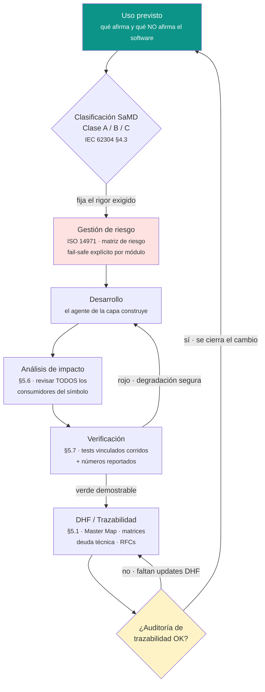

# Equipo de agentes y flujo SaMD

> Plantilla del SaMD Starter Kit. Este documento es la **vista de conjunto** de cómo
> trabaja el kit: quién hace qué (el equipo de 10 agentes, organizado por capa) y bajo
> qué ciclo lo hace (el flujo SaMD gobernado por la **Regla 0**). Fuente de verdad de
> los agentes: [`CLAUDE.md`](https://github.com/bryan-basg/samd-starter-kit/blob/main/CLAUDE.md)
> y `.claude/agents/`. Fuente de verdad del ciclo: el
> [Plan de Desarrollo de Software](../03_software_development_plan/SOFTWARE_DEVELOPMENT_PLAN.md).

---

## 1. El equipo de 10 agentes, por capa

El kit reparte el trabajo en **especialistas por capa**: cada agente carga las reglas
SaMD de su capa y trabaja aislado del contexto de las demás (consecuencia de IEC 62304
§5.6 análisis de impacto + §5.7 verificación). Cuando una tarea encaja claramente en una
capa, se delega al especialista en vez de trabajar "a mano alzada".

```mermaid
flowchart TB
    RULES["CLAUDE.md · Regla 0<br/>el cumplimiento SaMD manda"]

    subgraph BUILD["Capas de construcción"]
        direction LR
        subgraph L_DATA["Datos"]
            DB["db-architect<br/><small>schemas · migraciones · pool<br/>cifrado en reposo</small>"]
        end
        subgraph L_API["API + lógica"]
            BE["backend<br/><small>routers · services · auth<br/>audit · fusibles · scheduler</small>"]
        end
        subgraph L_UI["UI + cliente"]
            FE["frontend<br/><small>componentes · hooks · DAOs<br/>offline-first · neuro-UX</small>"]
        end
        subgraph L_PLAT["Plataforma"]
            CO["cloud-ops<br/><small>compute · BD gestionada<br/>secretos · CI/CD · deploys</small>"]
        end
        subgraph L_NATIVE["Nativo móvil"]
            MN["mobile-native<br/><small>empaquetado nativo · push<br/>build · firma · distribución</small>"]
        end
    end

    subgraph QUALITY["Capas de calidad y cumplimiento"]
        direction LR
        subgraph L_TEST["Testing / mutation"]
            QA["qa-mutation<br/><small>olas de mutation · killers<br/>ratchet de score</small>"]
        end
        subgraph L_SEC["Seguridad regulatoria"]
            SEC["security-samd<br/><small>SAST · cifrado · JWT-only<br/>pentest vs OpenAPI</small>"]
        end
        subgraph L_I18N["Internacionalización"]
            I18N["i18n-translations<br/><small>locales · paridad · plurales<br/>glosario pre-certificación</small>"]
        end
        subgraph L_REG["Regulatorio (DHF)"]
            AUDIT["samd-audit-trace<br/><small>AUDITA el changeset<br/>detecta gaps</small>"]
            DOCS["docs-dhf<br/><small>ESCRIBE los updates<br/>Master Map · matrices · RFCs</small>"]
        end
    end

    RULES --> BUILD
    RULES --> QUALITY
    BUILD -. "verifica / endurece" .-> QUALITY
    AUDIT -. "reporta gaps a" .-> DOCS

    style RULES fill:#0d9488,color:#fff
    style L_REG fill:#fef3c7
```

**Cómo leer el diagrama.** La **Regla 0** configura a todos los agentes: ninguna capa
queda fuera del cumplimiento. Las **capas de construcción** (Datos, API, UI, Plataforma,
Nativo) producen el software; las **capas de calidad y cumplimiento** (Testing, Seguridad,
i18n, Regulatorio) lo verifican, lo endurecen y dejan trazabilidad. Dentro de la capa
Regulatoria hay una división deliberada: `samd-audit-trace` **audita** (detecta qué falta,
no lo escribe) y `docs-dhf` **materializa** esos updates en el DHF. Es la misma separación
auditor/redactor que exige un sistema de gestión de calidad.

| Agente | Capa | Se invoca cuando la tarea es sobre… |
|---|---|---|
| `db-architect` | Datos | Schemas, migraciones, pool de conexiones, cifrado en reposo, performance de queries. |
| `backend` | API + lógica | Routers, services, schemas, auth, audit middleware, fusibles de resiliencia, scheduler, tests. |
| `frontend` | UI + cliente | Componentes, hooks, DAOs HTTP, sync offline-first, cache, tests de UI, mutation, neuro-UX. |
| `cloud-ops` | Plataforma | Compute, BD gestionada, scheduler, gestor de secretos, hosting, CI/CD, deploys, monitoring. |
| `mobile-native` | Nativo móvil | Empaquetado del cliente web en app nativa, plugins nativos, push, build/firma/distribución. |
| `qa-mutation` | Testing / mutation | Olas de mutation testing, killers de mutantes, configs scoped, ratchet de score. |
| `security-samd` | Seguridad regulatoria | SAST, cifrado, gestión de claves, JWT-only, audit sin PII, pentest contra el contrato OpenAPI. |
| `i18n-translations` | Internacionalización | Locales en todos los idiomas, paridad, plurales, glosario clínico pre-certificación. |
| `samd-audit-trace` | Regulatorio (audita) | Auditar un changeset contra IEC 62304 §5.1/§5.7 + ISO 14971 antes de cerrar fase/PR. |
| `docs-dhf` | Regulatorio (escribe) | Materializar updates en Master Map, matrices de riesgo y trazabilidad, RFCs. Corre el link-checker. |

> La tabla refleja fielmente la de [`CLAUDE.md`](https://github.com/bryan-basg/samd-starter-kit/blob/main/CLAUDE.md).
> Si agregás, quitás o re-asignás un agente, actualizá **ambas** en la misma pasada
> (anti-drift de la fuente de verdad).

---

## 2. El flujo SaMD bajo la Regla 0

Todo cambio se subordina al cumplimiento SaMD. El ciclo no es lineal "y listo": es un
**lazo cerrado** que parte del uso previsto y vuelve a él a través de la trazabilidad.

**Cómo leer el flujo.**

1. **Uso previsto → Clasificación (Clase A/B/C).** La declaración de uso previsto es la
   que fija la clase, y la clase fija *cuánto rigor* exige cada actividad. Más detalle en
   [Software Safety Classification](../07_regulatory_and_compliance/SOFTWARE_SAFETY_CLASSIFICATION.md).
2. **Gestión de riesgo (ISO 14971).** Antes de construir, cada módulo con impacto en la
   persona usuaria recibe su análisis de riesgo y su **fail-safe explícito**: cuando algo
   falla, degrada de forma segura y visible, nunca en silencio. Ver
   [ISO 14971 Risk Matrix](../07_regulatory_and_compliance/ISO_14971_RISK_MATRIX.md).
3. **Desarrollo → Análisis de impacto (§5.6).** Un cambio no termina en el archivo donde
   se tocó: se revisan **todos** los consumidores del símbolo modificado (búsqueda global).
4. **Verificación (§5.7).** Nada se declara "verde" sin correr los tests vinculados y
   **reportar los números**. Si la verificación da rojo, el sistema vuelve a desarrollo con
   degradación segura — no se avanza con un fallo silencioso.
5. **DHF / Trazabilidad (§5.1) → puerta de auditoría.** El cambio recién se cierra cuando
   la trazabilidad está reflejada (Master Map, matrices de riesgo y trazabilidad, deuda
   técnica, RFCs) y la auditoría lo confirma. El lazo vuelve al uso previsto: ningún cambio
   puede expandir lo que el software afirma más allá de su clasificación.

> **Glosario pre-certificación.** Mientras la certificación esté pendiente, el producto se
> describe como una herramienta que ofrece **valoraciones** para **profesionales**, sin
> afirmar una función de dispositivo médico aún no certificada. Este documento describe el
> *proceso de ingeniería*, no un claim clínico.

---

**Navegación:** [Índice del DHF](../README.md) · [Master Map](../00_master/MASTER_MAP.md) · [Visión de Arquitectura](./ARCHITECTURE_OVERVIEW.md) · [Plan de Desarrollo](../03_software_development_plan/SOFTWARE_DEVELOPMENT_PLAN.md)
