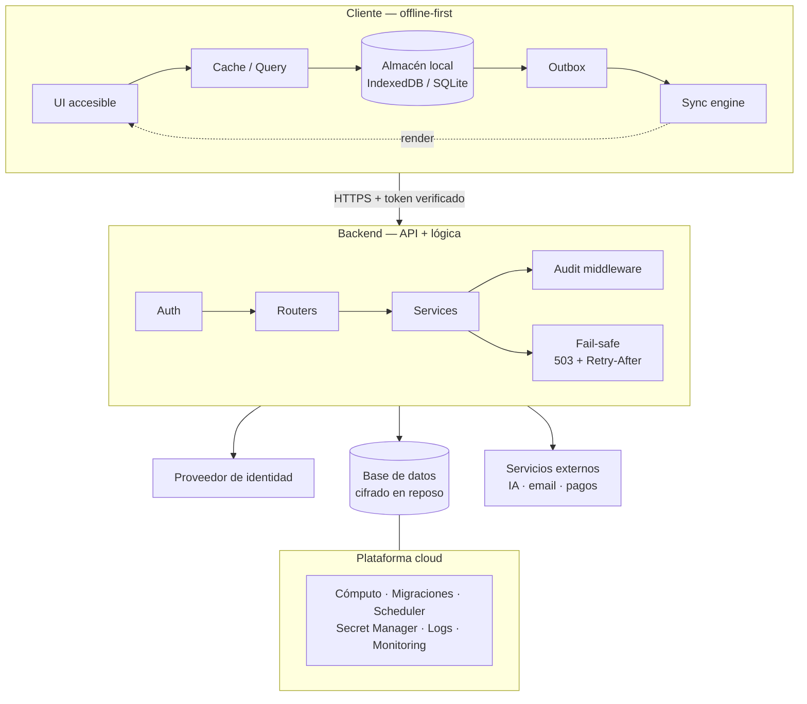

# Visión de Arquitectura

**Proyecto:** {{PROJECT_NAME}} · **Clase SaMD:** {{SAMD_CLASS}} · **Versión:** v0.1 · **Fecha:** 2026-01-01

> Plantilla del SaMD Starter Kit. Reemplazá los marcadores `{{...}}` y ajustá el diagrama a tu topología real.

---

## 1. Principios de arquitectura

1. **Offline-first**: toda mutación de datos pasa primero por un almacén local (cola/outbox) → sincronización. Nunca eludir el motor de sincronización.
2. **Identidad desde el token**: la identidad del sujeto se deriva exclusivamente del token verificado, nunca de un `id` recibido en body o query.
3. **Fail-safe explícito** (ISO 14971): el fallo degrada de forma segura y visible.
4. **Asincronía**: I/O no bloqueante en el backend.
5. **Tipado estricto y errores empáticos**: sin tracebacks ni metadatos internos hacia el cliente.

---

## 2. Diagrama de alto nivel

---

## 3. Decisiones clave de arquitectura

| ID | Decisión | Motivo | RFC |
|---|---|---|---|
| ADR-001 | Offline-first con outbox | Continuidad de uso sin red; integridad de datos clínicos | <RFC-XXX> |
| ADR-002 | Identidad solo desde token verificado | Anti-IDOR; evita suplantación | <RFC-XXX> |
| ADR-003 | Cifrado en reposo de campos sensibles | Protección de PHI/PII | <RFC-XXX> |
| ADR-004 | Migraciones automáticas con aborto ante fallo | Proteger producción | <RFC-XXX> |
| ADR-005 | <añadir> | <motivo> | <RFC-XXX> |

---

## 4. Ítems de software y clase de seguridad (IEC 62304 §5.3)

> Clasificá cada ítem: **A** (no contribuye a daño), **B** (daño no serio posible), **C** (daño serio o muerte posible). El producto hereda la clase del ítem más alto salvo segregación demostrada.

| Ítem de software | Descripción | Clase de seguridad | Justificación |
|---|---|---|---|
| Motor de algoritmo clínico | <qué calcula/decide> | <A/B/C> | <daño posible si falla> |
| Motor de sincronización offline | Persistencia y orden de mutaciones | <A/B/C> | <pérdida/corrupción de datos> |
| Capa de autenticación/identidad | Resolución del sujeto | <A/B/C> | <acceso indebido a PHI> |
| Capa de notificaciones/alertas | Avisos clínicos al usuario | <A/B/C> | <alerta perdida> |
| UI de cliente | Presentación e interacción | <A/B/C> | <error de interpretación> |
| Integraciones externas (IA/3os) | <qué proveen> | <A/B/C> | <dato erróneo a decisión> |

---

## 5. Puntos de fail-safe (ISO 14971)

| Punto | Modo de fallo | Comportamiento seguro esperado |
|---|---|---|
| Pérdida de red en cliente | Sin backend | Operar offline; encolar mutaciones; avisar estado, no bloquear |
| Backend saturado (pool BD agotado) | 503 | Degradar con `503 + Retry-After`; mensaje empático; sin traceback |
| Fallo de algoritmo clínico | Excepción | No mostrar resultado dudoso; estado "no disponible"; registrar incidente |
| Fallo de servicio de IA | Timeout/error | Degradar a flujo sin IA; nunca inventar dato clínico |
| Fallo de migración | Schema inconsistente | Abortar deploy; mantener versión previa |

---

## 6. Versionado de este documento

| Versión | Fecha | Autor | Cambio |
|---|---|---|---|
| v0.1 | 2026-01-01 | {{OWNER}} | Plantilla inicial |

---
**Navegación:** [Índice del DHF](../README.md) · [Master Map](../00_master/MASTER_MAP.md)
